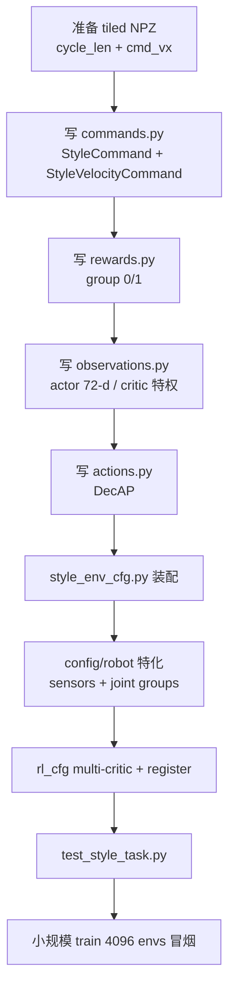

这是一个**架构迁移**问题，不是简单 rename。结论先说：

> **不要以 tracking 文件夹为骨架改 style。**  
> 现有 `tasks/style/` 的设计是：**velocity 的观测/任务层 + tracking 的 MotionLoader + APEX 的周期模仿**。  
> 若你 copy 了 tracking，相当于从错误范式出发，要改的地方会非常多。

下面按「保留 / 删除 / 新建 / 接线」给你一份可操作的改造清单。

---

## 一、两种任务的本质差异

| 维度 | Tracking（BeyondMimic） | Style（APEX 风格模仿） |
|------|-------------------------|------------------------|
| 学习目标 | 跟踪**整条时空轨迹** \(x^*(t)\) | 学**周期步态** \(q^*_\phi\) + **速度任务** \(v_{cmd}\) |
| Command | 单一 `MotionCommand` | 双 Command：`StyleCommand` + `StyleVelocityCommand` |
| Actor 观测 | 看到参考帧误差（anchor pos/ori 等） | **只看到** \(\omega, g, v_{cmd}, q, \dot q, a\)（可部署 72-d） |
| 风格信息 | 直接进 Actor | **不进 Actor**，通过 reward / DecAP / Critic 特权 obs |
| 奖励 | 全身 pose/vel tracking | Group 0 周期模仿 + Group 1 速度跟踪 |
| 动作 | 普通 `JointPositionAction` | `DecapJointPositionAction`（\(q_{cmd}=q_\pi+\lambda_t(q^*-q)\)） |
| RL | 单 Critic | **Multi-Critic PPO**（`num_reward_groups=2`） |
| Termination | anchor 跟踪失败 | 倾倒角 / timeout（不绑 anchor） |

数学上，tracking 优化的是：

\[
r_{track} \approx \exp\left(-\|x(t) - x^*(t)\|^2\right)
\]

style 优化的是：

\[
r_{style} = \exp\left(-\frac{1}{n}\sum_i (q_i - q^*_{\phi,i})^2 / \sigma\right), \quad
r_{task} = \exp\left(-\|v - v_{cmd}\|^2\right)
\]

相位 \(\phi\) 由 clip 循环推进，**不依赖世界坐标对齐**——这是和 tracking 最大的算法分歧。

---

## 二、推荐起点（比 copy tracking 更省工）

```
tasks/style/
├── style_env_cfg.py          ← 主工厂（参考现有 style，不是 tracking_env_cfg）
├── mdp/
│   ├── commands.py           ← StyleCommand + StyleVelocityCommand
│   ├── rewards.py            ← 周期模仿 reward
│   ├── observations.py       ← Actor/Critic 观测
│   ├── actions.py            ← DecAP
│   └── __init__.py
├── config/<robot>/
│   ├── env_cfgs.py           ← 机器人/asset/传感器/关节分组
│   ├── rl_cfg.py             ← Multi-Critic PPO
│   └── __init__.py           ← register_mjlab_task
└── rl/runner.py              ← ONNX 导出（可选）
```

**从 velocity 借**：观测布局、DR events、速度 reward、contact sensor、termination。  
**从 tracking 借**：仅 `MotionLoader`（style 已 `from mjlab.tasks.tracking.mdp.commands import MotionLoader`）。  
**从零写**：`StyleCommand`、style rewards、DecAP、multi-critic 配置。

---

## 三、若已 copy tracking，逐项改造

### Step 0：先删 / 别留的东西

这些 tracking 专有逻辑**不要保留**：

| 文件/模块 | 原因 |
|-----------|------|
| `MotionCommand` / `MotionCommandCfg` | 全身时空跟踪 + adaptive sampling，与 style 范式冲突 |
| `tracking_env_cfg.py` 里的 actor obs（`motion_anchor_pos_b` 等） | Actor 不应看到参考轨迹 |
| tracking rewards（`motion_global_root_pos`、`motion_body_pos` 等） | 世界系/相对系全身跟踪，不是周期相位模仿 |
| tracking terminations（`bad_anchor_pos`、`bad_motion_body_pos`） | style 用 `bad_orientation` |
| `mdp/metrics.py`、`mdp/terminations.py`（tracking 版） | 一般不需要 |
| `scripts/evaluate.py`（tracking 版） | 评估指标不同 |

---

### Step 1：`mdp/commands.py` — 参考信号生成器

**保留**：`MotionLoader`（直接 import tracking 的，不必复制 680 行）。

**重写**为两个 Command：

**① `StyleCommand`** — 周期专家参考

```python
# 核心职责
time_steps += 1; time_steps %= N          # 线性推进，wrap  guard
φ = (time_steps % cycle_len) / cycle_len  # 步态相位
q* = motion.joint_pos[time_steps]         # 相位参考，非世界系 x*(t)
```

还需提供：
- `style_joint_pos`, `style_feet_yaw_b`, `style_g_xy`, `gait_phase`
- `is_standing`：读 `twist` command，\(\|v_{cmd,xy}\| < threshold\) 时切 default pose
- `_apply_rsi`：reset 时从 clip 随机相位初始化（tracking 也有类似逻辑，可借鉴 RSI 部分）

**② `StyleVelocityCommand`** — 继承 `UniformVelocityCommand`

```python
vx = clip(cmd_vx + noise, 0.2, 0.8)
vy = 0
ωz ~ U[-1.5, 1.5]
```

**NPZ 格式要求**（比 tracking 多两个字段）：

```python
fps          # 必须 = 1/step_dt
cycle_len    # 一个步态周期帧数
cmd_vx       # 专家前进速度
joint_pos, joint_vel, body_pos_w, body_quat_w, ...
```

---

### Step 2：`mdp/rewards.py` — 奖励塑形

**删掉** tracking 的 6 个 motion tracking reward。

**新建** style 模仿核（注意 APEX 用的是 `exp(-mean/σ)`，不是 `exp(-sum/σ²)`）：

\[
r = \exp\left(-\frac{\mathrm{mean}_i(q_i - q^*_{\phi,i})^2}{\sigma}\right)
\]

| Reward term | 作用 | group |
|-------------|------|-------|
| `imitate_joint_legs/waist/head` | 关节角模仿 | 0 |
| `imitate_feet` | yaw 系足端位置 | 0 |
| `imitate_tilt` | roll/pitch（\(g_{xy}\)） | 0 |
| `track_linear_velocity` | 跟踪 \(v_x\) | 1 |
| `track_angular_velocity` | 跟踪 \(\omega_z\) | 1 |
| velocity penalties | torques, slip, collision 等 | 1 |
| `imitation_height_penalty` | 高度约束 | 1 |

**关键**：reward 函数只读 `StyleCommand` 的属性，**不要在 reward 里自己算相位**——相位逻辑集中在 command 里。

---

### Step 3：`mdp/observations.py` — 观测空间对齐

这是 Sim-to-Real 的核心分界：

**Actor（部署态，72-d）** — 对齐 velocity，**不含** \(q^*_\phi\)、phase：

```
ω (biased) + g (biased) + v_cmd (twist) + q + q̇ + a_prev
```

**Critic（训练特权）** — 在 actor 基础上加：

```
v_lin (真值) + gait_phase + q* + feet* + g_xy*
```

改造 tracking copy 时：
- 删掉 actor 里所有 `motion_anchor_*`、`body_pos/ori`
- actor 的 `command` 从 `"motion"` 改成 `"twist"`
- critic 加 `gait_phase`, `style_joint_pos`, `style_feet_yaw_b`, `style_g_xy`

---

### Step 4：`mdp/actions.py` — DecAP 动作先验

tracking 用的是普通 `JointPositionAction`，style 必须换：

\[
q_{cmd} = q_\pi + \lambda_t (q^* - q), \quad \lambda_t = \gamma^{s/k}
\]

```python
# 训练: decap_enabled=True, schedule="exp", gamma=0.99, k=500
# 部署/play: decap_enabled=False  → 纯 policy 输出
```

**注意**：`steps_per_iteration` 必须和 `RslRlOnPolicyRunnerCfg.num_steps_per_env` 一致（Marsdog 是 24）。

Standing 时 \(q^*\) 已在 `StyleCommand` 里切到 default pose，DecAP 和 reward 自动一致。

---

### Step 5：`style_env_cfg.py` — 总装配

这是最大的一文件改动。对照现有 `style_env_cfg.py`，核心结构：

```python
commands = {
    "style": StyleCommandCfg(motion_file="", resampling_time_range=(1e9, 1e9)),
    "twist": StyleVelocityCommandCfg(resampling_time_range=(5.0, 5.0), ...),
}

actions = {
    "joint_pos": DecapJointPositionActionCfg(command_name="style", ...),
}

rewards = { ... group=0 style ..., ... group=1 velocity ... }

terminations = { time_out, bad_orientation(70°), nan_detection }  # 不是 anchor
```

**Events 从 velocity 搬**，不是 tracking：
- `foot_friction_slide`, `base_mass`, `link_mass`, `base_com`
- `encoder_bias`, `pd_gains`, `imu_bias`, `push_robot`

**Episode**：style 用 ~19s（多步态周期），tracking 通常 10s。

---

### Step 6：`config/<robot>/env_cfgs.py` — 机器人特化

这里保留 tracking config 的**模式**（覆盖 joint names、sensor、foot geom），但内容跟 velocity marsdog 更像：

```python
cfg = make_style_env_cfg(joint_names=MARSDOG_JOINT_NAMES)
cfg.scene.entities = {"robot": get_marsdog_robot_cfg()}
cfg.scene.sensors = (feet_ground_cfg, self_collision_cfg)

# 按关节分组覆盖 reward 的 asset_cfg
cfg.rewards["imitate_joint_legs"].params["asset_cfg"] = SceneEntityCfg(...)

# play 模式
joint_pos_action.decap_enabled = False
twist.play_mode = True
```

---

### Step 7：`rl_cfg.py` — Multi-Critic

tracking 是单 critic；style **必须**双 group：

```python
algorithm=RslRlMultiCriticPpoAlgorithmCfg(
    num_reward_groups=2,
    advantage_weights=(0.5, 0.5),  # style : task
    ...
)
```

否则 group 0/1 的 reward 无法正确分配 advantage。

---

### Step 8：注册与测试

```python
# config/marsdog/__init__.py
register_mjlab_task(
    task_id="Mjlab-Style-Flat-Marsdog",
    env_cfg=marsdog_flat_env_cfg(),
    play_env_cfg=marsdog_flat_env_cfg(play=True),
    rl_cfg=marsdog_style_ppo_runner_cfg(),
    runner_cls=StyleOnPolicyRunner,
)
```

最小测试应覆盖：
- NPZ `cycle_len` / `cmd_vx` / FPS 校验
- `StyleCommand.gait_phase` 循环
- DecAP \(\lambda_t\) 衰减曲线
- Multi-critic advantage 融合
- env reset + 一步 step 不 crash

---

## 四、保留 vs 更改速查表

| 组件 | 从 tracking copy 来 | 实际做法 |
|------|---------------------|----------|
| `MotionLoader` | ✅ 保留（import 即可） | 不复制，直接 `from tracking.mdp.commands import MotionLoader` |
| `MotionCommand` | ❌ 删除 | 换成 `StyleCommand` |
| Actor 观测 | ❌ 全换 | 用 velocity 布局 |
| Critic 观测 | ❌ 全换 | actor + 特权 style 特征 |
| Rewards | ❌ 全换 | 周期模仿 + velocity tracking |
| Actions | ❌ 换 DecAP | `DecapJointPositionAction` |
| Commands | ❌ 双 command | `style` + `twist` |
| Events/DR | ❌ 换 velocity 版 | tracking DR 太轻 |
| Terminations | ❌ 换 velocity 版 | 不用 anchor 终止 |
| RL config | ❌ 换 multi-critic | `num_reward_groups=2` |
| `config/` 目录结构 | ✅ 保留模式 | 内容按 marsdog style 写 |
| `rl/runner.py` | ⚠️ 简化 | 主要是 ONNX 导出 |
| Contact sensors | ❌ 从 velocity 搬 | feet_ground + self_collision |

---

## 五、改造顺序（建议）



---

## 六、常见踩坑

1. **Actor 偷看 \(q^*\)**：一旦 actor obs 含 `style_joint_pos` 或 phase，部署时观测空间对不齐，Sim-to-Real 直接废。
2. **Reward 核函数写错**：用 `exp(-sum/σ²)` 会让 14-DoF 腿 reward 永远 ≈ 0；必须用 `exp(-mean/σ)`。
3. **FPS 不匹配**：`StyleCommand` 会 hard fail，NPZ fps 必须等于 `1/step_dt`（decimation=4, dt=0.005 → 50 Hz）。
4. **忘记 standing 门控**：速度和风格 reference 必须在 `StyleCommand.is_standing` 里统一处理，不要在每个 reward 里各自判断。
5. **DecAP 和 play 模式**：导出 ONNX 前必须 `decap_enabled=False`，否则部署多了一路不可观测的 prior。
6. **从 tracking 改 vs 从 velocity 改**：前者要改 ~80% 文件；后者只加 style 特有模块。现有 repo 的 `answer/qingpu.md` 也明确写了：**从 MarsDog velocity 骨架起步，而不是改 tracking**。

---

如果你已经 copy 了 tracking 文件夹，最快路径是：**对照现有 `tasks/style/` 逐文件 diff**，把 tracking 里能用的（主要是 `MotionLoader`、config 注册模式）留下，其余按上面清单替换。需要的话我可以按你 copy 后的具体目录结构，帮你列一份「这个文件改什么、那个文件删不删」的文件级 checklist。